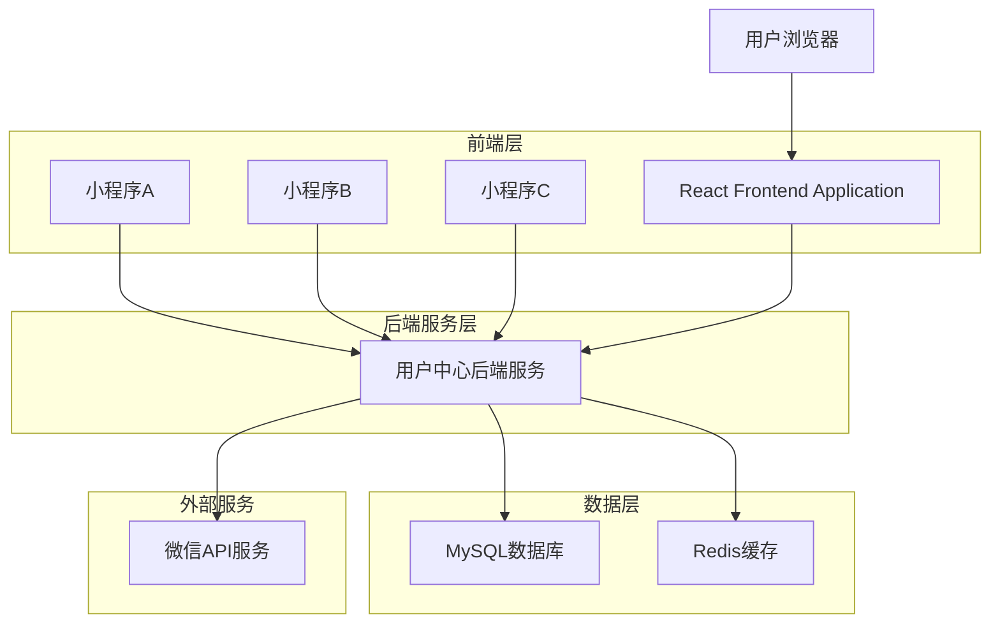
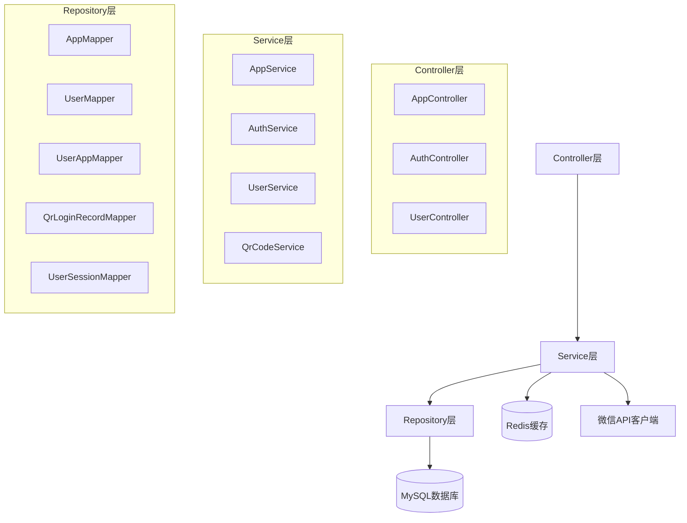
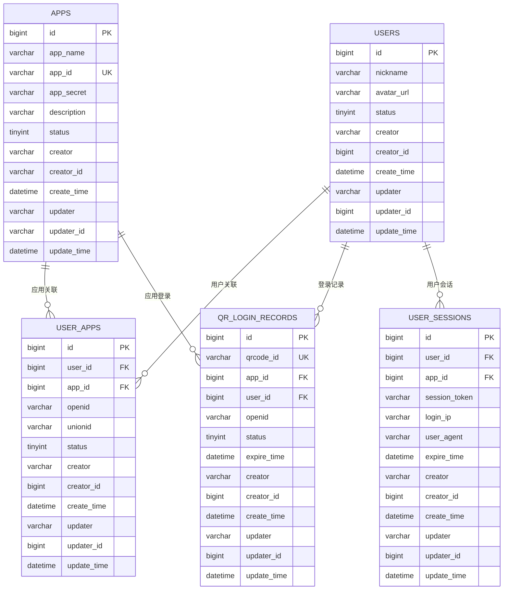

# 多应用架构技术设计文档

## 1. 架构设计



## 2. 技术描述

- 前端：React@18 + tailwindcss@3 + vite（管理后台）
- 小程序：微信小程序原生开发
- 后端：Spring Boot@2.7 + MyBatis Plus@3.5
- 数据库：MySQL@8.0
- 缓存：Redis@6.0
- 外部服务：微信小程序API

## 3. 路由定义

| 路由 | 用途 |
|------|------|
| /admin/login | 管理后台登录页面 |
| /admin/dashboard | 管理后台首页，显示统计数据 |
| /admin/apps | 应用管理页面，管理接入的小程序 |
| /admin/users | 用户管理页面，查看和管理用户 |
| /admin/sessions | 会话管理页面，查看活跃会话 |
| /qrcode/login | 二维码登录页面 |

## 4. API定义

### 4.1 应用管理API

**创建应用**
```
POST /api/admin/apps
```

Request:
| 参数名 | 参数类型 | 是否必填 | 描述 |
|--------|----------|----------|------|
| appName | string | true | 应用名称 |
| appId | string | true | 微信小程序AppId |
| appSecret | string | true | 微信小程序AppSecret |
| description | string | false | 应用描述 |

Response:
| 参数名 | 参数类型 | 描述 |
|--------|----------|------|
| success | boolean | 操作是否成功 |
| data | object | 应用信息 |

**获取应用列表**
```
GET /api/admin/apps
```

Response:
```json
{
  "success": true,
  "data": {
    "list": [
      {
        "id": 1,
        "appName": "商城小程序",
        "appId": "wx1234567890",
        "status": 1,
        "createTime": "2024-01-01T10:00:00Z"
      }
    ],
    "total": 1
  }
}
```

### 4.2 用户认证API

**小程序登录**
```
POST /api/auth/miniprogram/login
```

Request:
| 参数名 | 参数类型 | 是否必填 | 描述 |
|--------|----------|----------|------|
| appId | string | true | 小程序AppId |
| code | string | true | 微信授权码 |
| userInfo | object | false | 用户信息 |

Response:
```json
{
  "success": true,
  "data": {
    "token": "jwt_token_here",
    "userInfo": {
      "id": 1,
      "nickname": "用户昵称",
      "avatarUrl": "https://avatar.url"
    }
  }
}
```

**二维码登录确认**
```
POST /api/auth/qrcode/confirm
```

Request:
| 参数名 | 参数类型 | 是否必填 | 描述 |
|--------|----------|----------|------|
| qrcodeId | string | true | 二维码ID |
| appId | string | true | 小程序AppId |
| code | string | true | 微信授权码 |

### 4.3 用户管理API

**获取用户列表**
```
GET /api/admin/users?appId={appId}&page={page}&size={size}
```

Response:
```json
{
  "success": true,
  "data": {
    "list": [
      {
        "id": 1,
        "nickname": "用户昵称",
        "avatarUrl": "https://avatar.url",
        "appCount": 2,
        "lastLoginTime": "2024-01-01T10:00:00Z"
      }
    ],
    "total": 100
  }
}
```

## 5. 服务架构图



## 6. 数据模型

### 6.1 数据模型定义



### 6.2 数据定义语言

**应用表 (apps)**
```sql
-- 创建应用表
CREATE TABLE apps (
    id BIGINT PRIMARY KEY AUTO_INCREMENT COMMENT '应用ID',
    app_name VARCHAR(100) NOT NULL COMMENT '应用名称',
    app_id VARCHAR(100) UNIQUE NOT NULL COMMENT '微信小程序AppId',
    app_secret VARCHAR(200) NOT NULL COMMENT '微信小程序AppSecret',
    description VARCHAR(500) COMMENT '应用描述',
    status TINYINT DEFAULT 1 COMMENT '应用状态：1-正常，0-禁用',
    creator VARCHAR(50) COMMENT '创建人',
    creator_id VARCHAR(50) COMMENT '创建人ID',
    create_time DATETIME DEFAULT CURRENT_TIMESTAMP COMMENT '创建时间',
    updater VARCHAR(50) COMMENT '更新人',
    updater_id VARCHAR(50) COMMENT '更新人ID',
    update_time DATETIME DEFAULT CURRENT_TIMESTAMP ON UPDATE CURRENT_TIMESTAMP COMMENT '更新时间'
) ENGINE=InnoDB DEFAULT CHARSET=utf8mb4 COMMENT='应用表';

-- 创建索引
CREATE INDEX idx_apps_app_id ON apps(app_id);
CREATE INDEX idx_apps_status ON apps(status);
CREATE INDEX idx_apps_create_time ON apps(create_time);
```

**用户表 (users) - 更新版**
```sql
-- 更新用户表（移除openid和unionid，这些信息移到user_apps表）
CREATE TABLE users (
    id BIGINT PRIMARY KEY AUTO_INCREMENT COMMENT '用户ID',
    nickname VARCHAR(50) COMMENT '昵称',
    avatar_url VARCHAR(500) COMMENT '头像URL',
    status TINYINT DEFAULT 1 COMMENT '用户状态：1-正常，0-禁用',
    creator VARCHAR(50) COMMENT '创建人',
    creator_id VARCHAR(50) COMMENT '创建人ID',
    create_time DATETIME DEFAULT CURRENT_TIMESTAMP COMMENT '创建时间',
    updater VARCHAR(50) COMMENT '更新人',
    updater_id VARCHAR(50) COMMENT '更新人ID',
    update_time DATETIME DEFAULT CURRENT_TIMESTAMP ON UPDATE CURRENT_TIMESTAMP COMMENT '更新时间'
) ENGINE=InnoDB DEFAULT CHARSET=utf8mb4 COMMENT='用户表';

-- 创建索引
CREATE INDEX idx_users_status ON users(status);
CREATE INDEX idx_users_create_time ON users(create_time);
```

**用户应用关联表 (user_apps)**
```sql
-- 创建用户应用关联表
CREATE TABLE user_apps (
    id BIGINT PRIMARY KEY AUTO_INCREMENT COMMENT '关联ID',
    user_id BIGINT NOT NULL COMMENT '用户ID',
    app_id BIGINT NOT NULL COMMENT '应用ID',
    openid VARCHAR(100) NOT NULL COMMENT '微信小程序openId',
    unionid VARCHAR(100) COMMENT '微信unionId',
    status TINYINT DEFAULT 1 COMMENT '关联状态：1-正常，0-禁用',
    creator VARCHAR(50) COMMENT '创建人',
    creator_id VARCHAR(50) COMMENT '创建人ID',
    create_time DATETIME DEFAULT CURRENT_TIMESTAMP COMMENT '创建时间',
    updater VARCHAR(50) COMMENT '更新人',
    updater_id VARCHAR(50) COMMENT '更新人ID',
    update_time DATETIME DEFAULT CURRENT_TIMESTAMP ON UPDATE CURRENT_TIMESTAMP COMMENT '更新时间',
    UNIQUE KEY uk_user_app (user_id, app_id),
    UNIQUE KEY uk_app_openid (app_id, openid),
    FOREIGN KEY (user_id) REFERENCES users(id) ON DELETE CASCADE,
    FOREIGN KEY (app_id) REFERENCES apps(id) ON DELETE CASCADE
) ENGINE=InnoDB DEFAULT CHARSET=utf8mb4 COMMENT='用户应用关联表';

-- 创建索引
CREATE INDEX idx_user_apps_user_id ON user_apps(user_id);
CREATE INDEX idx_user_apps_app_id ON user_apps(app_id);
CREATE INDEX idx_user_apps_openid ON user_apps(openid);
CREATE INDEX idx_user_apps_unionid ON user_apps(unionid);
```

**二维码登录记录表 (qr_login_records) - 更新版**
```sql
-- 更新二维码登录记录表（增加app_id字段）
CREATE TABLE qr_login_records (
    id BIGINT PRIMARY KEY AUTO_INCREMENT COMMENT '记录ID',
    qrcode_id VARCHAR(64) UNIQUE NOT NULL COMMENT '二维码唯一标识',
    app_id BIGINT COMMENT '应用ID（扫码时填入）',
    user_id BIGINT COMMENT '用户ID（扫码确认后填入）',
    openid VARCHAR(100) COMMENT '微信小程序openId',
    status TINYINT DEFAULT 0 COMMENT '状态：0-待扫码，1-已扫码待确认，2-已确认，3-已过期',
    expire_time DATETIME NOT NULL COMMENT '过期时间',
    creator VARCHAR(50) COMMENT '创建人',
    creator_id VARCHAR(50) COMMENT '创建人ID',
    create_time DATETIME DEFAULT CURRENT_TIMESTAMP COMMENT '创建时间',
    updater VARCHAR(50) COMMENT '更新人',
    updater_id VARCHAR(50) COMMENT '更新人ID',
    update_time DATETIME DEFAULT CURRENT_TIMESTAMP ON UPDATE CURRENT_TIMESTAMP COMMENT '更新时间',
    FOREIGN KEY (app_id) REFERENCES apps(id) ON DELETE SET NULL,
    FOREIGN KEY (user_id) REFERENCES users(id) ON DELETE SET NULL
) ENGINE=InnoDB DEFAULT CHARSET=utf8mb4 COMMENT='二维码登录记录表';

-- 创建索引
CREATE INDEX idx_qr_login_qrcode_id ON qr_login_records(qrcode_id);
CREATE INDEX idx_qr_login_app_id ON qr_login_records(app_id);
CREATE INDEX idx_qr_login_status ON qr_login_records(status);
CREATE INDEX idx_qr_login_expire_time ON qr_login_records(expire_time);
```

**用户会话表 (user_sessions) - 更新版**
```sql
-- 更新用户会话表（增加app_id字段）
CREATE TABLE user_sessions (
    id BIGINT PRIMARY KEY AUTO_INCREMENT COMMENT '会话ID',
    user_id BIGINT NOT NULL COMMENT '用户ID',
    app_id BIGINT COMMENT '应用ID',
    session_token VARCHAR(255) NOT NULL COMMENT '会话令牌',
    login_ip VARCHAR(45) COMMENT '登录IP',
    user_agent VARCHAR(500) COMMENT '用户代理',
    expire_time DATETIME NOT NULL COMMENT '过期时间',
    creator VARCHAR(50) COMMENT '创建人',
    creator_id VARCHAR(50) COMMENT '创建人ID',
    create_time DATETIME DEFAULT CURRENT_TIMESTAMP COMMENT '创建时间',
    updater VARCHAR(50) COMMENT '更新人',
    updater_id VARCHAR(50) COMMENT '更新人ID',
    update_time DATETIME DEFAULT CURRENT_TIMESTAMP ON UPDATE CURRENT_TIMESTAMP COMMENT '更新时间',
    FOREIGN KEY (user_id) REFERENCES users(id) ON DELETE CASCADE,
    FOREIGN KEY (app_id) REFERENCES apps(id) ON DELETE SET NULL
) ENGINE=InnoDB DEFAULT CHARSET=utf8mb4 COMMENT='用户会话表';

-- 创建索引
CREATE INDEX idx_sessions_token ON user_sessions(session_token);
CREATE INDEX idx_sessions_user_id ON user_sessions(user_id);
CREATE INDEX idx_sessions_app_id ON user_sessions(app_id);
CREATE INDEX idx_sessions_expire_time ON user_sessions(expire_time);
```

**初始化数据**
```sql
-- 插入示例应用数据
INSERT INTO apps (app_name, app_id, app_secret, description, creator) VALUES
('商城小程序', 'wx1234567890abcdef', 'secret1234567890abcdef', '电商购物小程序', 'Ravey'),
('服务小程序', 'wx0987654321fedcba', 'secret0987654321fedcba', '客户服务小程序', 'Ravey');
```

## 7. 多应用架构实现方案

### 7.1 核心设计原则

1. **统一用户身份**：一个用户可以在多个小程序中使用同一账号
2. **应用隔离**：不同应用的数据和权限相互隔离
3. **灵活扩展**：支持动态添加新的小程序应用
4. **安全可控**：每个应用都有独立的配置和权限控制

### 7.2 用户统一机制

通过 `unionid` 实现用户在多个小程序间的身份统一：

1. 当用户首次在某个小程序登录时，创建用户记录
2. 在 `user_apps` 表中记录用户与应用的关联关系
3. 当用户在其他小程序登录时，通过 `unionid` 找到已存在的用户
4. 在 `user_apps` 表中新增该用户与新应用的关联关系

### 7.3 权限隔离策略

1. **数据隔离**：所有业务数据都关联 `app_id`，确保应用间数据隔离
2. **API隔离**：所有API调用都需要传入 `app_id` 参数进行应用识别
3. **会话隔离**：用户在不同应用中的会话独立管理
4. **配置隔离**：每个应用有独立的配置信息（AppId、AppSecret等）

### 7.4 扩展性考虑

1. **应用类型扩展**：预留 `app_type` 字段，支持小程序、H5、APP等多种应用类型
2. **权限系统扩展**：可基于 `user_apps` 表扩展角色权限系统
3. **多租户扩展**：可基于应用维度实现多租户架构
4. **数据统计扩展**：支持跨应用的用户行为分析和统计

### 7.5 实现流程

**小程序登录流程**：
1. 小程序调用登录API，传入 `app_id` 和微信授权 `code`
2. 后端通过 `app_id` 获取对应的 `app_secret`
3. 调用微信API获取用户的 `openid` 和 `unionid`
4. 通过 `unionid` 查找是否已存在用户记录
5. 如果不存在，创建新用户；如果存在，使用现有用户
6. 在 `user_apps` 表中记录或更新用户与应用的关联关系
7. 生成会话token并返回给小程序

**二维码登录流程**：
1. Web端生成二维码，不关联特定应用
2. 用户使用任意小程序扫码，传入对应的 `app_id`
3. 后端记录扫码的应用信息
4. 用户确认登录后，Web端获得用户在该应用中的身份信息
5. 生成跨应用的统一会话token

这种架构设计既保证了用户身份的统一性，又实现了应用间的有效隔离，为后续的功能扩展提供了良好的基础。