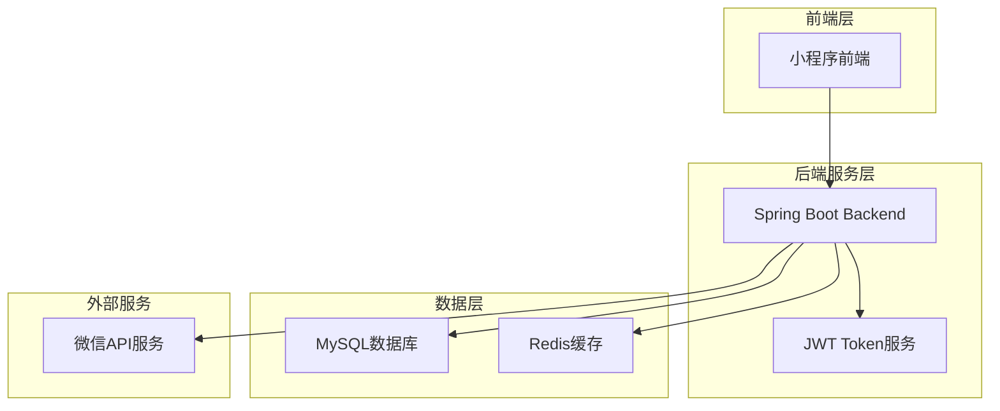
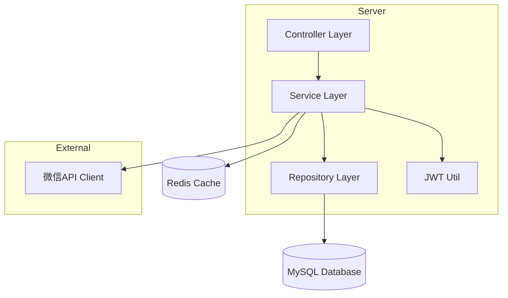
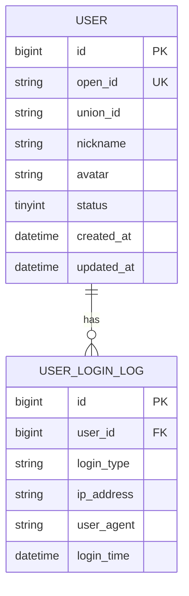

# 小程序微信快速登录技术架构文档

## 1. Architecture design



## 2. Technology Description
- Frontend: 微信小程序原生开发框架
- Backend: Spring Boot@2.7 + Spring Security@5.7 + MyBatis-Plus@3.5
- Database: MySQL@8.0
- Cache: Redis@6.2
- Authentication: JWT@0.11 + 微信小程序登录API

## 3. Route definitions
| Route | Purpose |
|-------|---------|
| /api/front/wechat/login | 微信授权登录接口，处理授权码换取用户信息 |
| /api/front/wechat/refresh | 刷新JWT token接口 |
| /api/front/user/info | 获取当前用户信息接口 |
| /api/front/user/logout | 用户退出登录接口 |

## 4. API definitions

### 4.1 Core API

微信授权登录
```
POST /api/front/wechat/login
```

Request:
| Param Name| Param Type  | isRequired  | Description |
|-----------|-------------|-------------|-------------|
| code      | string      | true        | 微信授权码 |
| appId     | string      | true        | 小程序AppId |

Response:
| Param Name| Param Type  | Description |
|-----------|-------------|-------------|
| success   | boolean     | 请求是否成功 |
| data      | object      | 返回数据 |
| message   | string      | 响应消息 |

Example
```json
{
  "success": true,
  "data": {
    "token": "eyJhbGciOiJIUzI1NiIsInR5cCI6IkpXVCJ9...",
    "refreshToken": "eyJhbGciOiJIUzI1NiIsInR5cCI6IkpXVCJ9...",
    "userInfo": {
      "userId": "123456",
      "nickname": "微信用户",
      "avatar": "https://wx.qlogo.cn/...",
      "openId": "oxxxxxxxxxxxxxx"
    }
  },
  "message": "登录成功"
}
```

刷新Token
```
POST /api/front/wechat/refresh
```

Request:
| Param Name   | Param Type  | isRequired  | Description |
|--------------|-------------|-------------|-------------|
| refreshToken | string      | true        | 刷新令牌 |

Response:
| Param Name| Param Type  | Description |
|-----------|-------------|-------------|
| success   | boolean     | 请求是否成功 |
| data      | object      | 新的token信息 |

获取用户信息
```
GET /api/front/user/info
```

Request Headers:
| Header Name   | Header Type | isRequired  | Description |
|---------------|-------------|-------------|-------------|
| Authorization | string      | true        | Bearer {token} |

Response:
| Param Name| Param Type  | Description |
|-----------|-------------|-------------|
| success   | boolean     | 请求是否成功 |
| data      | object      | 用户信息 |

## 5. Server architecture diagram



## 6. Data model

### 6.1 Data model definition



### 6.2 Data Definition Language

用户表 (user)
```sql
-- 创建用户表
CREATE TABLE `user` (
    `id` BIGINT NOT NULL AUTO_INCREMENT COMMENT '用户ID',
    `open_id` VARCHAR(64) NOT NULL COMMENT '微信OpenID',
    `union_id` VARCHAR(64) DEFAULT NULL COMMENT '微信UnionID',
    `nickname` VARCHAR(50) DEFAULT NULL COMMENT '用户昵称',
    `avatar` VARCHAR(255) DEFAULT NULL COMMENT '用户头像URL',
    `status` TINYINT DEFAULT 1 COMMENT '用户状态：1-正常，0-禁用',
    `created_at` DATETIME DEFAULT CURRENT_TIMESTAMP COMMENT '创建时间',
    `updated_at` DATETIME DEFAULT CURRENT_TIMESTAMP ON UPDATE CURRENT_TIMESTAMP COMMENT '更新时间',
    PRIMARY KEY (`id`),
    UNIQUE KEY `uk_open_id` (`open_id`),
    KEY `idx_union_id` (`union_id`),
    KEY `idx_created_at` (`created_at`)
) ENGINE=InnoDB DEFAULT CHARSET=utf8mb4 COMMENT='用户表';

-- 创建用户登录日志表
CREATE TABLE `user_login_log` (
    `id` BIGINT NOT NULL AUTO_INCREMENT COMMENT '日志ID',
    `user_id` BIGINT NOT NULL COMMENT '用户ID',
    `login_type` VARCHAR(20) NOT NULL DEFAULT 'wechat' COMMENT '登录类型',
    `ip_address` VARCHAR(45) DEFAULT NULL COMMENT 'IP地址',
    `user_agent` VARCHAR(500) DEFAULT NULL COMMENT '用户代理',
    `login_time` DATETIME DEFAULT CURRENT_TIMESTAMP COMMENT '登录时间',
    PRIMARY KEY (`id`),
    KEY `idx_user_id` (`user_id`),
    KEY `idx_login_time` (`login_time`)
) ENGINE=InnoDB DEFAULT CHARSET=utf8mb4 COMMENT='用户登录日志表';

-- 初始化数据
INSERT INTO `user` (`open_id`, `nickname`, `avatar`, `status`) VALUES 
('test_open_id_001', '测试用户1', 'https://wx.qlogo.cn/test1.jpg', 1),
('test_open_id_002', '测试用户2', 'https://wx.qlogo.cn/test2.jpg', 1);
```