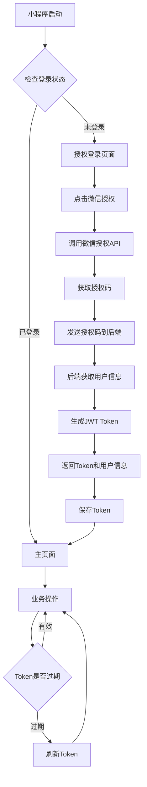

# 小程序微信快速登录功能需求文档

## 1. Product Overview
小程序微信快速登录功能是一个基于微信小程序生态的用户身份认证系统，为用户提供便捷、安全的一键登录体验。
- 通过微信官方授权机制，用户无需注册即可快速登录，降低用户使用门槛，提升用户体验和转化率。
- 该功能将显著提升小程序的用户留存率和活跃度，为业务增长提供有力支撑。

## 2. Core Features

### 2.1 User Roles
| Role | Registration Method | Core Permissions |
|------|---------------------|------------------|
| 小程序用户 | 微信授权登录 | 可使用小程序基础功能，查看个人信息，进行业务操作 |

### 2.2 Feature Module
小程序微信快速登录功能包含以下核心页面：
1. **授权登录页面**: 微信授权按钮、隐私政策说明、登录状态提示
2. **用户信息页面**: 用户头像、昵称显示、登录状态管理、退出登录功能
3. **登录管理页面**: token刷新、登录状态验证、自动登录设置

### 2.3 Page Details
| Page Name | Module Name | Feature description |
|-----------|-------------|---------------------|
| 授权登录页面 | 微信授权模块 | 调用微信授权API，获取用户授权码，处理授权回调，显示登录状态 |
| 授权登录页面 | 隐私政策模块 | 展示用户协议和隐私政策，确保合规性 |
| 用户信息页面 | 用户信息展示 | 显示用户头像、昵称、微信绑定状态等基本信息 |
| 用户信息页面 | 登录状态管理 | 管理用户登录状态，提供退出登录功能 |
| 登录管理页面 | Token管理 | 自动刷新JWT token，维持登录状态，处理token过期 |
| 登录管理页面 | 自动登录 | 记住登录状态，下次启动自动登录 |

## 3. Core Process
用户操作流程如下：

1. 用户打开小程序，系统检查本地登录状态
2. 如未登录，跳转到授权登录页面
3. 用户点击"微信授权登录"按钮
4. 调用微信授权API，获取授权码
5. 将授权码发送到后端服务器
6. 后端调用微信API获取用户信息
7. 生成JWT token并返回给前端
8. 前端保存token，跳转到主页面
9. 后续请求携带token进行身份验证

## 4. User Interface Design
### 4.1 Design Style
- 主色调：微信绿色 (#07C160) 和白色 (#FFFFFF)
- 辅助色：灰色 (#F7F7F7) 用于背景，深灰色 (#333333) 用于文字
- 按钮样式：圆角矩形，微信绿色背景，白色文字，轻微阴影效果
- 字体：系统默认字体，标题 18px，正文 14px，说明文字 12px
- 布局风格：简洁卡片式设计，顶部导航，内容居中对齐
- 图标风格：使用微信官方图标和简洁线性图标

### 4.2 Page Design Overview
| Page Name | Module Name | UI Elements |
|-----------|-------------|-------------|
| 授权登录页面 | 微信授权模块 | 微信绿色授权按钮，圆角设计，白色微信图标，"微信授权登录"文字，居中布局 |
| 授权登录页面 | 隐私政策模块 | 小字体灰色链接文字，底部对齐，"用户协议"和"隐私政策"可点击 |
| 用户信息页面 | 用户信息展示 | 圆形头像 80px，昵称 16px 黑色字体，卡片式白色背景，轻微圆角和阴影 |
| 用户信息页面 | 登录状态管理 | 红色"退出登录"按钮，圆角矩形，白色文字，底部固定位置 |

### 4.3 Responsiveness
该功能专为小程序设计，采用移动端优先的响应式布局，支持不同尺寸的手机屏幕，确保在各种设备上都有良好的用户体验。界面元素支持触摸操作优化，按钮大小符合移动端点击标准。